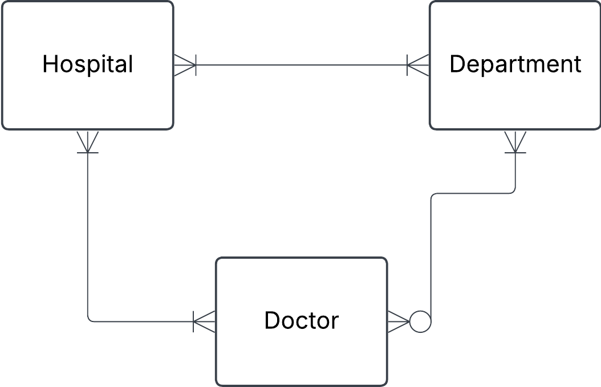
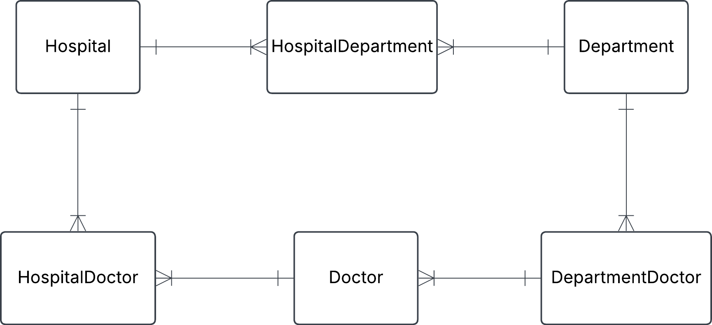
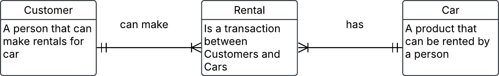
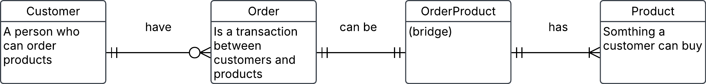

# Exercise 0

## 1. hospital task

``` json
{
  "hospital": "Sjukhusstock",
  "address": "Drottninggatan 3, Stockholm",
  "departments": [
    {
      "name": "Kardiologi",
      "doctors": [
        { "id": 1, "name": "Dr. Abra Abrahamson" },
        { "id": 2, "name": "Dr. Erika Eriksson" }
      ]
    },
    {
      "name": "Neurologi",
      "doctors": [{ "id": 3, "name": "Dr. Sven Svensson" }]
    }
  ]
}
```
## Solution

- identify entities 
- identify relationships and caridinalities 
- create conceptual erd
- create tables


**Intial naive conceptual ERD**

 

**Initial tables**

Hospital

| hospital_id | name         | address          |
|   -------   |  --------    | ----------       |
| 1           | Sjukhusstock | Drottninggatan 3 |
| 2           | Danderyd     | entrevägen 2     |


Department

| department_id | name       | 
| ------------- | --------   |
| 1             | Kardioloi  |
| 2             | Neurologi  |
| 3             | ortopedi   |


Doctor

| doctor_id | name                 |
| --------- | ---------------      |
| 1         | Dr. Abra Abrahamson  |
| 2         | Dr. Erika Erikson    |
| 3         | Dr. Sven Svensson    |
| 4         | Dr. Urban Urbanson   |


Refined with bridge tables to reflect many-to-many
relationships



# Exercise 0
## 1. Hospital task
### Solution

HospitalDepartment

| hospital_Department_id | hospital_id | department_id |
| -----------            | --------    | ------------- |
| 1                      | 1           | 1             |
| 2                      | 1           | 2             |
| 3                      | 2           | 3             |
| 4                      | 2           | 1             |

HospitalDoctor

| Hospital_Doctor_id | Hospital_id | Doctor_id    |
| --------------     | ---------   | -----------  |
|  1                 |      1      | 1            |
|  2                 |      1      | 2            |
|  3                 |      1      | 3            |
|  4                 |      2      | 4            |
|  5                 |      1      | 4            |


DepartmentDoctor

| Department_Doctor_id | Department_id | Doctor_id |
| -------------------- | ------------- | ------    |
| 1                    | 1             | 1         |
| 2                    | 1             | 2         |
| 3                    | 2             | 3         |
| 4                    | 3             | 4         |
| 5                    | 1             | 4         |

Test a join 

Want information on Sjukhusstock and its departments 
- hospital_department can join with department_id on 
department table and hospital_id on hospital_table
- query name from hospital table and name from department 
table


Hospital Sjukhusstock and its department
```
SELECT
	h.name,
	h.address,
	d.name,
FROM 
	staging.hospital h
LEFT JOIN staging.hospital_department hd ON h.hospital_id = hd.hospital_id 
LEFT JOIN staging.department d ON hd.department_id = d.department_id
WHERE h.name LIKE '%Sj%';
```
---

# Exercise 0
## 2. Library Bookly

A library called Bookly keeps track of books and members who borrow them. Each book has a title, author, and ISBN number. Each member has a membership ID, name, and contact information. A member can borrow multiple books, but each book can be borrowed by only one member at a time.

a) Identify the entities and attributes for each entity.

b) Determine the relationship between member and books.

c) Draw a conceptual ERD using crow foots notation.

### Solution 
a)

**Entity and attributes for each entity.**

**Book**
- title
- author
- ISBN

> [!NOTE] 
<br>
> ISBN is a unique number for the book, which could be used as a `primary key`, this will make it into a `natural key`

**Member**
- membership_id
- first_name
- last_name
- phone
- email
- adress

b)
- A Book can be Loan zero, one or sevral time
- A Loan is linked to one and only one Book
- A Loan can be made by one and only one Member
- A Member can do zero, one or sevral Loan


c)

Initial conceptual ERD


<br>
Refined with composity entity (bridge) table to reflect many-to-many relationship

<br>


---
## 3. Conceptual ERD to words 

This is an ERD conceptual diagram that a database designer and the business stakeholders agreed upon in a car rental company called Carent.

  


a) Describe the entities in this conceptual ERD.

b) Write out the relationship labels.

c) Describe the relationships between the entities (one-to-many, one-to-one and many-to-many).

d) Define the relationship statement for example: "A Customer can have one or more Rentals".

### Solution 

a) 

**Entity**
- Customer, a person that can make rentals for car
- Car, a product that can be rented by a person
- Rental (composite entity), is a transaction between Customers and Cars

b)

Alternative to put in descriptions into entities directly in conceptual ERD



c)

Customer to Rental (one-to-many)
Rental to Customer (one and only one)
Rental to Car (one and only one)
Car to Rental (one-to-many)


d)
- A Customer can make one or sevral Rental
- Rental is linked to one and only one Customer
- Rental can have one and only one Car
- A Car can be Rental one or sevral time

---

## 4. Online store

You are designing a database for an online store that sells multiple products. Customers can place multiple orders, and each order contains multiple products.

a) Identify entities and their relationships

b) Create a conceptual ERD with cardinalities

### solution

a)

**Entity and attributes for each entities**

**Product**
- product_id
- name
- description
- prise


**Customer**
- cutomer_id
- first_name
- last_name
- phone
- email
- adress

**Order**
- order_id
- customer_id
- product_id
- order_date
- close_date

composite entity (bridge) for Order and Product

**OrderProduct**

- OrderProduct_id
- order_id
- product_id 

<br>

**Describe relationships between entities**

- Customer to Order (zero-to-many)
- Order to Customer (one and only one)
- Order to OrderProduct (one and only one)
- OrderProduct to Order (one and only one)
- OrderProduct to Product (one and only one)
- Product to OrderProduct (one and only one)

<br>


**Define relationship statement**

- A Customer can have zero, one or sevral orders
- A Order can only have one customer
- A order can only have one


b)

