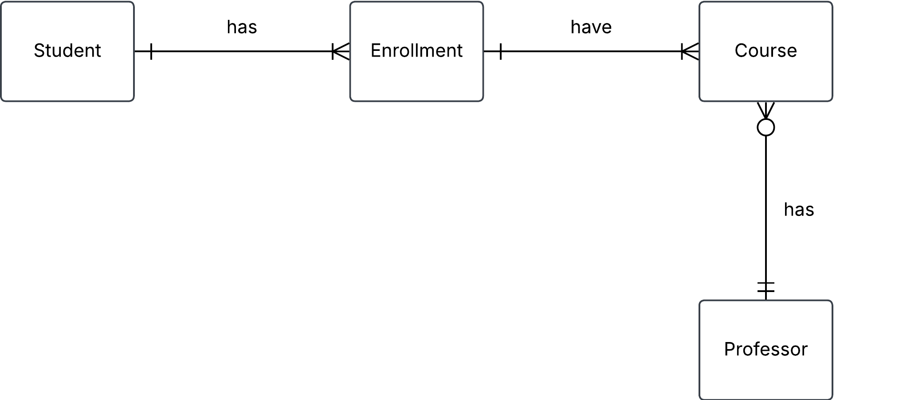

# Exercise 0

## 1. hospital task

``` json
{
  "hospital": "Sjukhusstock",
  "address": "Drottninggatan 3, Stockholm",
  "departments": [
    {
      "name": "Kardiologi",
      "doctors": [
        { "id": 1, "name": "Dr. Abra Abrahamson" },
        { "id": 2, "name": "Dr. Erika Eriksson" }
      ]
    },
    {
      "name": "Neurologi",
      "doctors": [{ "id": 3, "name": "Dr. Sven Svensson" }]
    }
  ]
}
```
## Solution

- identify entities 
- identify relationships and caridinalities 
- create conceptual erd
- create tables


**Intial naive conceptual ERD**

 

**Initial tables**

Hospital

| hospital_id | name         | address          |
|   -------   |  --------    | ----------       |
| 1           | Sjukhusstock | Drottninggatan 3 |
| 2           | Danderyd     | entrevägen 2     |


Department

| department_id | name       | 
| ------------- | --------   |
| 1             | Kardioloi  |
| 2             | Neurologi  |
| 3             | ortopedi   |


Doctor

| doctor_id | name                 |
| --------- | ---------------      |
| 1         | Dr. Abra Abrahamson  |
| 2         | Dr. Erika Erikson    |
| 3         | Dr. Sven Svensson    |
| 4         | Dr. Urban Urbanson   |


Refined with bridge tables to reflect many-to-many
relationships


# Exercise 0
## 1. Hospital task
### Solution

HospitalDepartment

| hospital_Department_id | hospital_id | department_id |
| -----------            | --------    | ------------- |
| 1                      | 1           | 1             |
| 2                      | 1           | 2             |
| 3                      | 2           | 3             |
| 4                      | 2           | 1             |

HospitalDoctor

| Hospital_Doctor_id | Hospital_id | Doctor_id    |
| --------------     | ---------   | -----------  |
|  1                 |      1      | 1            |
|  2                 |      1      | 2            |
|  3                 |      1      | 3            |
|  4                 |      2      | 4            |
|  5                 |      1      | 4            |


DepartmentDoctor

| Department_Doctor_id | Department_id | Doctor_id |
| -------------------- | ------------- | ------    |
| 1                    | 1             | 1         |
| 2                    | 1             | 2         |
| 3                    | 2             | 3         |
| 4                    | 3             | 4         |
| 5                    | 1             | 4         |

Test a join 

Want information on Sjukhusstock and its departments 
- hospital_department can join with department_id on 
department table and hospital_id on hospital_table
- query name from hospital table and name from department 
table


Hospital Sjukhusstock and its department
```
SELECT
	h.name,
	h.address,
	d.name,
FROM 
	staging.hospital h
LEFT JOIN staging.hospital_department hd ON h.hospital_id = hd.hospital_id 
LEFT JOIN staging.department d ON hd.department_id = d.department_id
WHERE h.name LIKE '%Sj%';
```
---

# Exercise 0
## 2. Library Bookly

A library called Bookly keeps track of books and members who borrow them. Each book has a title, author, and ISBN number. Each member has a membership ID, name, and contact information. A member can borrow multiple books, but each book can be borrowed by only one member at a time.

a) Identify the entities and attributes for each entity.

b) Determine the relationship between member and books.

c) Draw a conceptual ERD using crow foots notation.

### Solution 
a)

**Entity and attributes for each entity.**

**Book**
- title
- author
- ISBN

> [!NOTE] 
<br>
> ISBN is a unique number for the book, which could be used as a `primary key`, this will make it into a `natural key`

**Member**
- membership_id
- first_name
- last_name
- phone
- email
- adress

b)
- A Book can be Loan zero, one or sevral time
- A Loan is linked to one and only one Book
- A Loan can be made by one and only one Member
- A Member can do zero, one or sevral Loan


c)

Initial conceptual ERD


<br>
Refined with composity entity (bridge) table to reflect many-to-many relationship

<br>


---
## 3. Conceptual ERD to words 

This is an ERD conceptual diagram that a database designer and the business stakeholders agreed upon in a car rental company called Carent.

  


a) Describe the entities in this conceptual ERD.

b) Write out the relationship labels.

c) Describe the relationships between the entities (one-to-many, one-to-one and many-to-many).

d) Define the relationship statement for example: "A Customer can have one or more Rentals".

### Solution 

a) 

**Entity**
- Customer, a person that can make rentals for car
- Car, a product that can be rented by a person
- Rental (composite entity), is a transaction between Customers and Cars

b)

Alternative to put in descriptions into entities directly in conceptual ERD


c)

Customer to Rental (one-to-many)
Rental to Customer (one and only one)
Rental to Car (one and only one)
Car to Rental (one-to-many)


d)
- A Customer can makes one or sevral Rentals over time
- Each Rental is connected to one Customer
- Eache Rental is for one Car
- Each Car can be in sevral rentals

---

## 4. Online store

You are designing a database for an online store that sells multiple products. Customers can place multiple orders, and each order contains multiple products.

a) Identify entities and their relationships

b) Create a conceptual ERD with cardinalities

### solution

a)

**Entity and attributes for each entities**

**Product**
- product_id
- name
- description
- prise


**Customer**
- cutomer_id
- first_name
- last_name
- phone
- email
- adress

**Order**
- order_id
- customer_id
- product_id
- order_date
- close_date

composite entity (bridge) for Order and Product

**OrderProduct**

- OrderProduct_id
- order_id
- product_id 

<br>

**Describe relationships between entities**

- Customer to Order (zero-to-many)
- Order to Customer (one and only one)
- Order to OrderProduct (one and only one)
- OrderProduct to Order (one and only one)
- OrderProduct to Product (one and only one)
- Product to OrderProduct (one and only one)

<br>


**Define relationship statement**

- A Customer can have zero, one or sevral orders
- A Order can only have one customer
- A order can only have one


b)


---

## 5. University management system

A university needs a system to manage students, courses, and professors.

- each student can enroll in multiple courses.
- each course is taught by one professor.
- a teacher can teach multiple courses.

a) Identify entities and their relationships

b) Come up with possible attributes for the entities

c) Draw conceptual ERD with cardinalities

d) Define business rules (e.g. a student can enroll in max 4 courses)

### solution

a)

**Entity**
- Student, is a person who takes courses tought by a professor. 
- Course, where professor teach and student be taught.
- Professor, is a person who teaches the course.

**Relationship**
- Student to Course (one-to-many)
- Course to Student (zero or many)
- Course to Professor (one and only one)
- Professor to Course (one or zero)

**Relationships with composite entity**
- Student to Enrollment (one or many)
- Enrollment to Student (zero or one)
- Enrollment to Course (one-to-many)
- Course to Enrollment (zero or one)
- Course to Professor (one and only one)
- Professor to Course (zero or many)

b)

**Entity and attributes to each entities**

**Student**
- student_id
- first_name
- last_name
- phone
- email
- address

<br>

**Enrollment**
- enrollment_id
- student_id
- course_id

<br>

**Course**
- course_id
- name
- description
- start
- end

<br> 

**Professor**
- professor_id
- first_name
- last_name
- phone
- email
- address

c)

**Initial conceptual ERD**


**Elaborate conceptual ERD**



d)

``` 
ALTER TABLE Enrollment
ADD CONSTRAINT max_courses CHECK (
  (SELECT COUNT (*) FROM ENROLLMENT WHERE student_id = new_student_id) <= 4
);
```

---

## 6. Onshop

An e-commerce platform Onshop manages customers, orders, and products.

- a customer can place multiple orders.
- each order contains multiple products.
- a product can belong to multiple categories.

a) Identify key entities and their attributes (e.g., customer_name, order_date)

b) Sketch the conceptual ERD.

c) Define business rules

### Solution

a)

**Entitise and attributes**

***customer_name***

- customer_id
- first_name
- last_name
- phone
- email
- address


***Product***

- product_id
- name
- ingredients
- price
- amount

***Order_date***

- order_id
- cumstomer_id
- product_id
- start_date
- delivery_date
- end_date