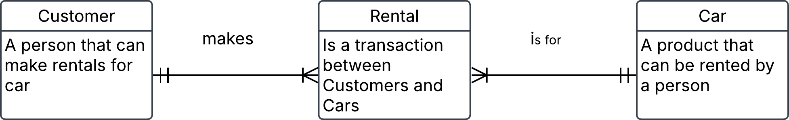

# 3. Conceptual ERD to words 

This is an ERD conceptual diagram that a database designer and the business stakeholders agreed upon in a car rental company called Carent.

  

a) Describe the entities in this conceptual ERD.

b) Write out the relationship labels.

c) Describe the relationships between the entities (one-to-many, one-to-one and many-to-many).

d) Define the relationship statement for example: "A Customer can have one or more Rentals".

## Solution 

a) 

**Describe entities**
- Customer, a person that can make rentals for car
- Car, a product that can be rented by a person
- Rental (composite entity), is a transaction between Customers and Cars

b)

***Relationships label***

- Cusotmer can `makes` one or more Rentals
- Rental can `have` one Customer
- Rental `is for` one Cars`
- Car can `exists` in one or more Rentals

Alternative to put in descriptions into entities directly in conceptual ERD

c)

Customer to Rental (one-to-many)
Rental to Customer (one and only one)
Rental to Car (one and only one)
Car to Rental (one-to-many)

d)
- A Customer can makes one or sevral Rentals over time
- Each Rental is connected to one Customer
- Eache Rental is for one Car
- Each Car can be in sevral rentals
