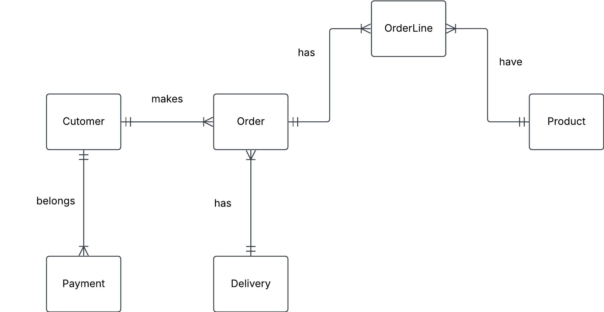

# 4. Online store

You are designing a database for an online store that sells multiple products. Customers can place multiple orders, and each order contains multiple products.

a) Identify entities and their relationships

b) Create a conceptual ERD with cardinalities

## Solution

a)

### Entity

***Customer***

***Payment***

***Delivery***

***Order***

***OrderLine***

***Product***

### Relationships and label

**Label**
- Pyment `belongs`to one and only one Cutomer
- Customer can `makes` one or more Orders
- Delivery `has` one or more Orders 
- Order `has` one or many OrderLine
- OrderLine can `have` one and only one Product

**Relationship**
- Payment to Customer (one and only one)
- Customer to Payment (one-to-many)
- Customer to Order (one or many)
- Order to Customer (one and only one)
- Delivery to Order (one-to-many)
- Customer to Order (one and only one)
- Order to OrderLine (one-to-many)
- OrderLine to Order (one and only one)
- OrderLine to Product (One and only one)
- Product to OrderLine (one-to-many)

b)

**Intitial conceptual ERD**

 

**Conceptual ERD**

