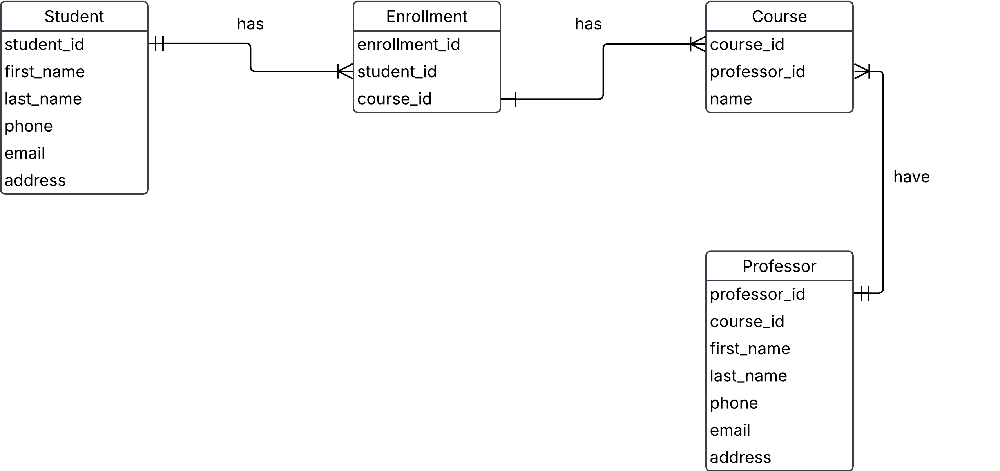

# 5. University management system

A university needs a system to manage students, courses, and professors.

- each student can enroll in multiple courses.
- each course is taught by one professor.
- a teacher can teach multiple courses.

a) Identify entities and their relationships

b) Come up with possible attributes for the entities

c) Draw conceptual ERD with cardinalities

d) Define business rules (e.g. a student can enroll in max 4 courses)

## Solution

a)

### Entities

***Student***

***Enrollment***

***Course***

***Professor***

### Labe

- Student `has` one or many Enrollment
- Enrollment `associated` to one and only one Student
- Enrollment `has` one or many Courses
- Course `is` in zero or one Enrollment
- Course `have` one and only one Professor
- Professor `can` teach in zero, one or many Coursers

### Relationship

- Student to Enrollment (one-to-many)
- Enrollment to Student (zero or one)
- Enrollment to Course (one-to-many)
- Course to Enrollment (zero or one)
- Course to Professor (one and only one)
- Professor to Course (zero or many)

b)

### Entities and attributes

***Student***
- student_id
- first_name
- last_name
- phone
- email
- address

***Enrollment***
- enrollment_id
- student_id
- course_id

***Course***
- course_id
- professor_id
- name

***Professor***
- professor_id
- course_id
- first_name
- last_name
- phone
- email
- address

c)

***Initial conceptual ERD***

***Conceptual ERD***

***Conceptual with attribute***

d)

***Business rules***
- a student can enroll in max 4 coursers
- a course only have one professor
- a student must be enrolled in at least 1 course
