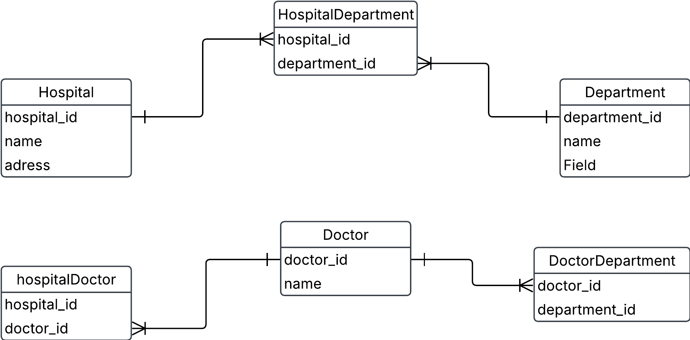

# 0. Hospital example

Going back to the hospital exercise from [exercise0, task 1](https://github.com/AIgineerAB/data_modeling_course/blob/main/exercises/exercise0.md), we will build logical and physical data models. This is the conceptual data model after we've added the composite entities to take care of many-to-many relationships.

a) Create a logical data model using lucidcharts

b) Identify different keys on the various entities

c) Identify child entities and parent entities. What makes them into parent/child relationships?

d) Create a physical data model using dbdiagram

e) Create a few tables manually, insert given data plus some more, and try to manually link foreign keys to primary keys. Can you satisfy that a doctor can work at several departments and several hospitals?

## Solution

a, b)

### Logical model and different key on various entities

***Hospital***
- hospital_id (primary key)
- name
- adress

***Department***
- department_id (primary key)
- name

***Doctor***
- doctor_id (primary key)
- name

Refined with bridge tables to reflect many-to-many
relationships

***HospitalDepartment***
- hospital_id (foreign key)
- department_id (foreign key)

***HospitalDoctor***
- hospital_id (foreign key)
- doctor_id (foreign key)

***DepartmentDoctor***
- department_id (foreign key)
- doctor_id (foreign key)

c)

**Parent entities**
- Hospital
- Department
- Doctor

**Child entities**
- HospitalDepartment
- HospitalDoctor
- DoctorDepartment

Parent entity have primary key and can existe independing meanwhile child entity is depending on a parent entity. The foreign key is linked to the primary key in parent entity.

e)

### Table

Doctor

| doctor_id | name              |
| ---       | ----              |
| 1         | Dr Abra Abrahamson|
| 2         | Dr Erika Erikson  |
| 3         | Dr Sven Svenson   |
| 4         | Dr Urban Urbanson |

Hospital

| hospital_id | name         | address          |
|   -------   |  --------    | ----------       |
| 1           | Sjukhusstock | Drottninggatan 3 |
| 2           | Danderyd     | entrevägen 2     |

Department

| department_id | name       | 
| ------------- | --------   |
| 1             | Kardiologi | 
| 2             | Neurologi  |
| 3             | ortopedi   |

HospitalDepartment

| hospital_Department_id | hospital_id | department_id |
| -----------            | --------    | ------------- |
| 1                      | 1           | 1             |
| 2                      | 1           | 2             |
| 3                      | 2           | 3             |
| 4                      | 2           | 1             |

HospitalDoctor

| Hospital_Doctor_id | Hospital_id | Doctor_id    |
| --------------     | ---------   | -----------  |
|  1                 |      1      | 1            |
|  2                 |      1      | 2            |
|  3                 |      1      | 3            |
|  4                 |      2      | 4            |
|  5                 |      1      | 4            |

DepartmentDoctor

| Department_Doctor_id | Department_id | Doctor_id |
| -------------------- | ------------- | ------    |
| 1                    | 1             | 1         |
| 2                    | 1             | 2         |
| 3                    | 2             | 3         |
| 4                    | 3             | 4         |
| 5                    | 1             | 4         |