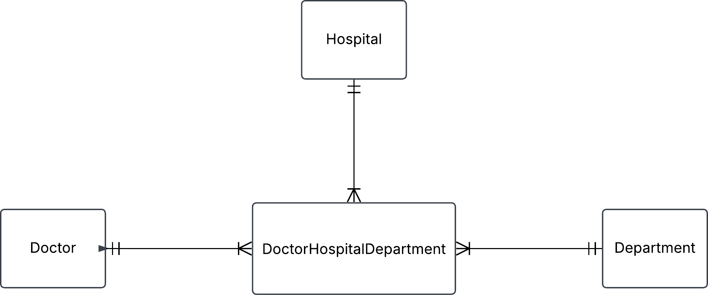
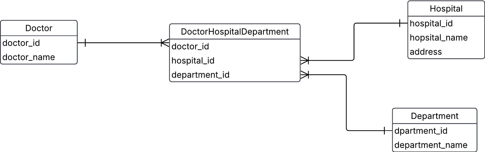

# 2. Revisiting the doctor example
Remember the doctor, hospital and department example from exercise0 and exercise1.
a) Does the design fulfill 3NF, motivate based on the rules for the normal forms.

b) You should have realised from this question in exercise1 0e)

> "Create a few tables manually, insert given data plus some more, and try to manually link foreign keys to primary keys. Can you satisfy that a doctor can work at `several departments and several hospitals?`"

that this creates ambiguity. This can be solved with a ternary relationship, which connects three entities simultaneously. Now make a new iteration for this data model.

c) In your design do you have bridge tables as well in addition to the ternary relationship. Motivate why you should or should not have them.

## Solution

a)

***Criteria fisrt Normal Form***
- row order doesn't matter 
- Primary key in each table 
- No repeating groups (no list in columns)
- uniform column data (no mixed data typ in column)

***Criteria second Normal Form***
- fulfill 1NF (yes)
- non-prime attributes must functionally dependes on the primary key, not just part of it (yes)

***Criteria third Normal Form***
- fulfill 2NF (yes)
- non-prime attributes must depends on the key, the whole key and nothing but the key (yes)

***Relationships schema notation***
- Hospital (<u>hospital_id</u>,name, address)
- Department (<u>department_id</u>, name)
- Doctor (<u>doctor_id</u>, name)

***3NF trivially***
- HospitalDoctor (<u>hospital_id</u>, <u>doctor_id</u>)
- DoctorDepartment (<u>doctor_id</u>, <u>department_id</u>)
- HospitalDepartment (<u>hospital_id</u>, <u>department_id</u>)

***Function dependency***
- hospital_id --> name, address
- doctor_id --> name
- department_id --> name 

b)

**Conceptual model**

***entity***
- Doctor
- Hospital
- Department

***Relationship Label***

- A Doctor can work at one or sevral Departments.
- Department has zero or many Doctors.
- A Department is locaded in one or sevral Hospital.
- Hospital contain one or many Department.
- A Doctor can work at on or many Hospital
- A Hospital has one or many doctors.

***conceptual model (ternary)***
- Doctor
- Hospital
- Department
- DoctorHospitalDepartment

**Logical model**

***Doctor***
- doctor_id
- doctor_name

***Hospital***
- hospital_id
- hospital_name
- address

***Department***
- department_id
- department_name

***DoctorHospitalDepartment***
- doctror_id
- hospital_id
- department_id

***Logical model***

**Physical model**

***Doctor***
- doctor_id (PK)
- doctor_name

Hospital
- hospital_id (PK)
- hospital_name
- address

Department
- department_id (PK)
- department_name

DoctorHospitalDepartment
- doctror_id (FK)
- hospital_id (FK)
- department_id (FK)
- composite primary key (doctor_id, hospital_id, department_id)

***Relationship schema notation***
- Doctor (<u>doctor_id</u>, doctor_name)
- Hospital (<u>hospital_id</u>, hopital_name, address)
- Department (<u>department_id</u>, department_name)

***Trivially***
- DoctorHospitalDepartment (<u>doctor_id</u>, <u>hospital_id</u>, <u>department_id</u> FK: doctor_id -> Doctor, FK: hospital_id -> Hospital, FK: department_id -> Department)

***Function dependency***
- hospital_id --> hospital_name
- doctor_id --> doctor_name
- department_id --> department_name

b)

C)

Skulle sätta en bridge table mellan Hospital och Department, för att kunna få ut vilka Department det finns i respektive sjukhus. Även med ternary relationship så får jag semantic correctness mellan hospital och Department.
