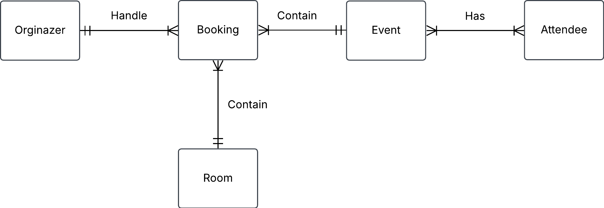
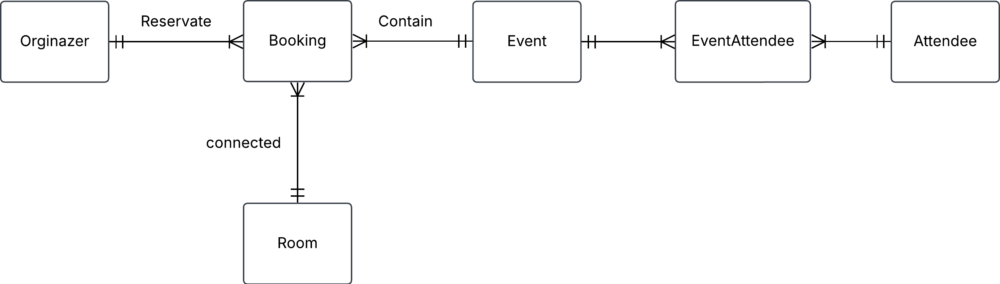
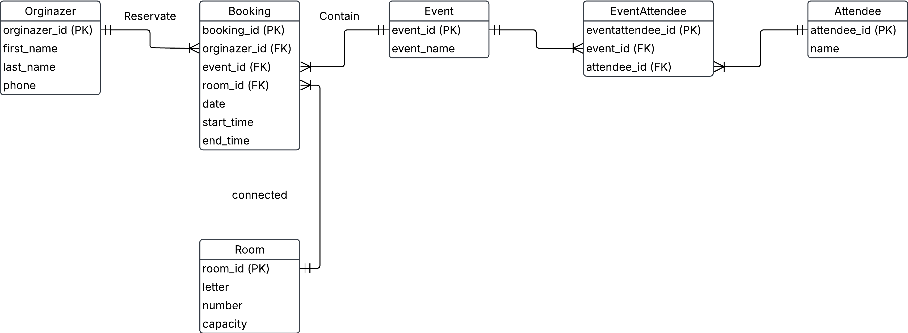

 # 1. Room booking
 
 A university wants to keep track of room bookings for events. The initial unnormalized data is stored in a single table:

|Bokking|RoomNumber|RoomCapacity|EventName   |EventDate |StartTime|EndTime|OrginazerName|OrginazerPhone|Attandee              |
|------ |----------|------------|---------   |--------- |---------|-------|-------------|--------------|--------              |
|  1    | A101     | 50         |AI workshop |2025-04-10|10:00    |12:00  |Alice Smith  | 123-456-78900|Bob,Charlie,David     |
|  2    | B202     | 100        |Data science|2025-04-11|14:00    |16:00  |John Doe     | 987-654-3210 |Eva,Frank,George,Helen|
|  3    | A101     | 50         |AI Workshop |2025-04-10|10:00    |12:00  |Alice Smith  | 123-456-78900|Charlie, David        |

Normalize this table into 3NF.

**Problems with this table**

1) Redundancy data. 

For example Roomcapacity repeating data, eventname repeting data and orginazername repeatingname.

2) Insertion anomaly

Definition: Inserting new data is not possible because missing values and attributes
Explain: If i want to add a new booking and don't have orginazer name

3) Update anomaly

Definition: Updating values lead to inconsitencies with other rows. Another word you haft to update same info sevral places.
Example: Update orginazer name for event name you need to do it sevral places.

4) Deletion anomaly

Definition: Delete a recored lead to unintentional loss of data.
Example: Delete phone number in orginazerphone, deletes the whole record

**Fulfills 1NF**

***critertion***
- Row order doesn't exists?   (yes)
- No listdata in attribute?   (No)
- No mixed data in attribute? (No)

**Fulfills 2NF**

***Creterion***
- Passing 1NF (No)
- Non-prime attributes must be functional dependency on entire  primary key and not part of it (No)

**Fulfills 3NF**

***Criterion***
- Passing 2NF (No)
- Non-prime attributes depends on the key, the hole key and nothing but the key (No) 

### Conceptual model
**Entity**

- Orginazer
- Booking
- Room
- Event
- EventAttendee
- Attendee

**Relationship label**

- Orginazer `reservate` one or sevral Bookings
- Booking `contain` one and only one Room
- Room is connected to one or sevral Bookings
- Event `has` one or sevral Attendees 

**Business rules**

- A booking can only be handle by one orginazer
- Event can only book one room, not two.

**Initial conceptual model ERD**

**Conceptual ERD**

### Logical model

***Orginazer***
- orginazer_id (PK)
- first_name
- last_name
- phone

***Booking***
- booking_id (PK)
- orginazer_id (FK)
- event_id (FK)
- room_id (FK)
- date
- start_time
- end_time

***Room***
- room_id (PK)
- letter
- number
- capacity

***Event***
- event_id (PK)
- event_name

***EventAttendee***
- eventattendee_id (PK)
- event_id (FK)
- attendee_id (FK)

***Attendee***
- attendee_id (FK)
- name

### Logical model ERD

### Physical model

**Added data in table**

***Orginazer***
| orginazer_id | first_name | last_name | phone        |
| -----------  | ---------- | --------- | -----        | 
| 1            | Alice      | Smith     | 123-456-7890 |
| 2            | John       | Doe       | 987-654-3210 |
| 3            | Ragnar     | Wagner    | 105-765-2340 |

***Booking***
| booking_id | orginazer_id | event_id | room_id | date       | start_time | end_time |
| ---------- | ------------ | -------- | ------- | ---------- | ---------- | -------- |
| 1          | 1            | 1        | 1       | 2025-04-10 | 10         | 12       |
| 2          | 2            | 2        | 2       | 2025-04-11 | 14         | 16       |
| 3          | 3            | 1        | 1       | 2025-04-10 | 12         | 14       |

***Room***
| room_id | letter | number | capacity |
| ------- | ------ | ------ | -------- |
| 1       |  A     | 101    | 50       |
| 2       |  B     | 202    | 100      |

***Event***
| event_id | event_name   |
| -------- | ----------   |
| 1        | AI Workshop  |
| 2        | Data Science |

***EventAttendee***
| eventattendee | event_id | attendee_id |
| ------------- | -------- | ----------- |
| 1             |  1       | 1           |
| 1             |  1       | 2           |
| 1             |  1       | 3           |
| 2             |  2       | 4           |
| 2             |  2       | 5           |
| 2             |  2       | 6           |
| 2             |  2       | 7           |

***Attendee***
| attendee_id | name    |
| ----------  | ------- |
| 1           | Bob     |
| 2           | Cahrlie |
| 3           | David   |
| 4           | Eva     |
| 5           | Frank   |
| 6           | George  |
| 7           | Helen   |

