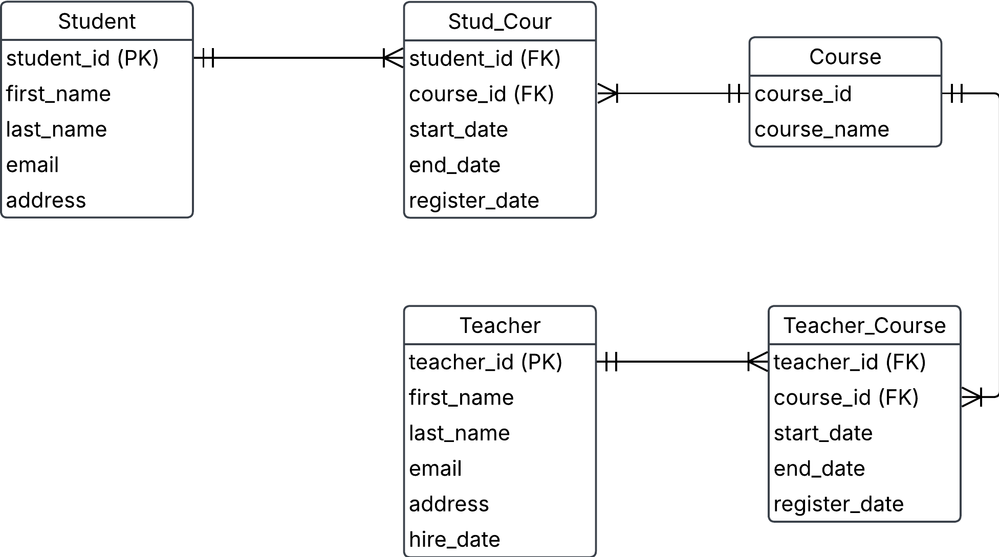

# 2. Student and teachers
 The business requirement for this school are:
 - students that can be enrolled in courses in a school
 - a course can have up to 3 teachers
 - more business requirements up for you to decide

 ## Solution

***entities***
 
- Student
- StudentCourse
- Course
- TeacherCourse
- Teacher

***relationships label***

- Student `registered` in one or many StudentCourse
- StudentCourse `has` one and only one Course
- Course `leads` by one or many TeacherCourse
- TeacherCourse `has` one and only one Teacher

***Logical model***
Student
- student_id (PK)
- first_name
- last_name
- email
- address

StudentCourse
- student_id
- course_id
- start_date
- end_date
PRIMARY KEY (student_id, course_id) composite primary key

Course
- course_id (PK)
- course_name

TeacherCourse
- teacher_id
- course_id
- start_date
- end_date
- register_id
PRIMARY KEY (teacher_id, course_id) composite primary key

Teacher
- teacher_id (PK)
- first_name
- last_name
- email
- address
- hire_date

***Logical ERD***

